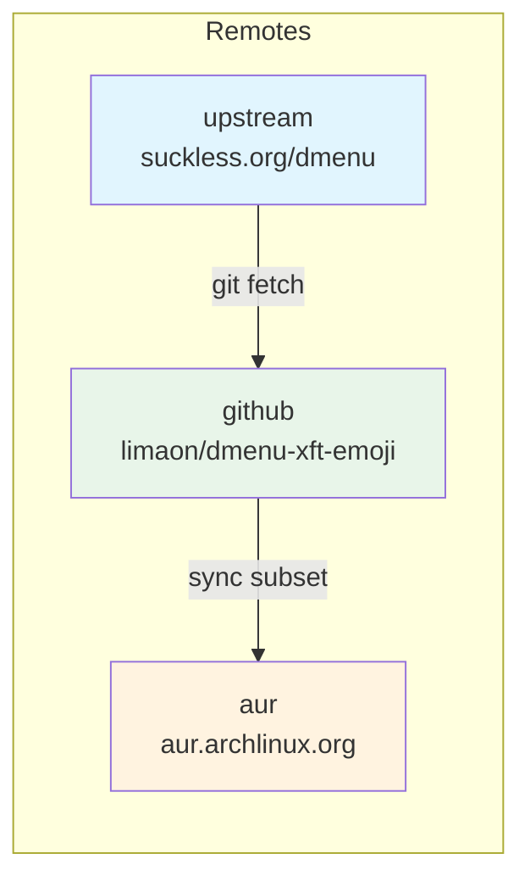
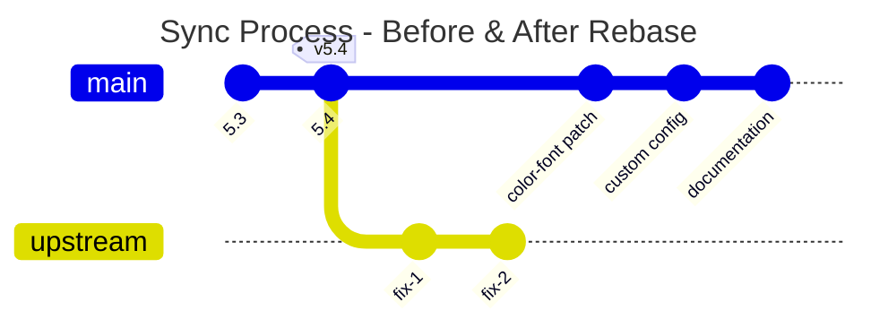
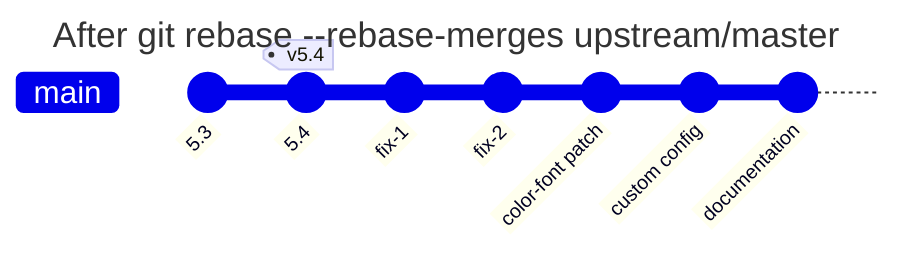
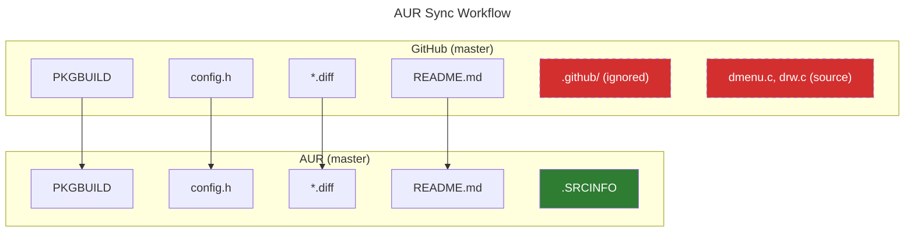

# dmenu-xft-emoji

**dmenu** with native color-font (emoji) rendering and automatic CJK fallback (漢字、かな、カタカナ). Built on top of dmenu 5.4 with a small patch set and a cascading font stack (`Terminus → Noto Sans CJK JP → Noto Color Emoji → monospace`).

## Features

* **Emoji support** via the *allow‑color‑font* patch.
* Seamless fallback for Chinese, Japanese and Korean glyphs.
* Lean, easy‑to‑edit `config.h`.
* Arch Linux package (`PKGBUILD`) that **provides dmenu** and can fully replace the stock build.
* Upstream repo is tagged, making builds reproducible.

## Installation

### AUR (recommended)

```bash
paru -S dmenu-xft-emoji      # or yay / pikaur / aurutils …
```

> **Runtime deps**: `libxft`, `libxinerama`, `fontconfig`
> **Suggested fonts**: `terminus-font`, `noto-fonts`, `noto-fonts-cjk`, `noto-fonts-emoji`

## Quick test

```bash
echo -e "Hello 👋\nこんにちは" | dmenu -i
```

If both the emoji and the Kanji render, fallback is working.

## Repository Structure



## Updating from Upstream

This project tracks the official dmenu from [suckless.org](https://git.suckless.org/dmenu).

### Initial Setup (one-time)

```bash
git remote add upstream https://git.suckless.org/dmenu
```

### Sync with Upstream

```bash
# Fetch latest changes
git fetch upstream

# Rebase my commits onto latest upstream
git rebase --rebase-merges upstream/master

# If conflicts occur:
git status                    # see conflicted files
git checkout --ours FILE      # keep my changes (or --theirs for upstream)
git add FILE
git rebase --continue

# Update patch file if drw.c changed
git diff upstream/master -- drw.c > dmenu-allow-color-font-5.4.diff
git add dmenu-allow-color-font-5.4.diff
git commit -m "chore: Update patch for upstream"

# Push to GitHub (force needed after rebase)
git push github master --force
```

### How Rebase Works



**Before rebase:** My patches are based on an older upstream version.



**After rebase:** My patches are replayed on top of the latest upstream.

### Updating Checksums

After modifying patch or config files:

```bash
sha256sum dmenu-allow-color-font-*.diff config.h
# Update PKGBUILD sha256sums array accordingly
```

## Syncing to AUR

Since AUR doesn't allow subdirectories (like `.github/`), use this workflow to sync updates:



```bash
# Create clean branch from AUR
git checkout -b aur-sync aur/master

# Copy only AUR-compatible files from master
git checkout master -- PKGBUILD config.h dmenu-allow-color-font-*.diff README.md

# Update .SRCINFO (must match PKGBUILD)
# Edit .SRCINFO with new version, checksums, and source files

# Commit and push to AUR
git add -A
git commit -m "Update to dmenu X.Y"
git push aur aur-sync:master

# Clean up
git checkout master
git branch -D aur-sync
```

### .SRCINFO Format

The `.SRCINFO` file must be manually updated to match `PKGBUILD`:

```
pkgbase = dmenu-xft-emoji
	pkgdesc = dmenu with color-font (emoji) and CJK fallback support
	pkgver = 5.4
	pkgrel = 1
	url = https://tools.suckless.org/dmenu/
	arch = x86_64
	license = MIT
	depends = libxft
	depends = libxinerama
	depends = fontconfig
	optdepends = terminus-font: bitmap Terminus for X11
	source = https://dl.suckless.org/tools/dmenu-5.4.tar.gz
	source = dmenu-allow-color-font-5.4.diff
	source = config.h
	sha256sums = <dmenu-tarball-checksum>
	sha256sums = <patch-checksum>
	sha256sums = <config-checksum>

pkgname = dmenu-xft-emoji
```

## Contributing

1. **Fork** and create a topic branch: `git checkout -b feature/name`.
2. Commit in logical chunks with clear English messages.
3. Open a pull request against `main`.
4. Use the issue tracker for questions or bug reports.

## License

Released under the MIT License. See `LICENSE` for details.
