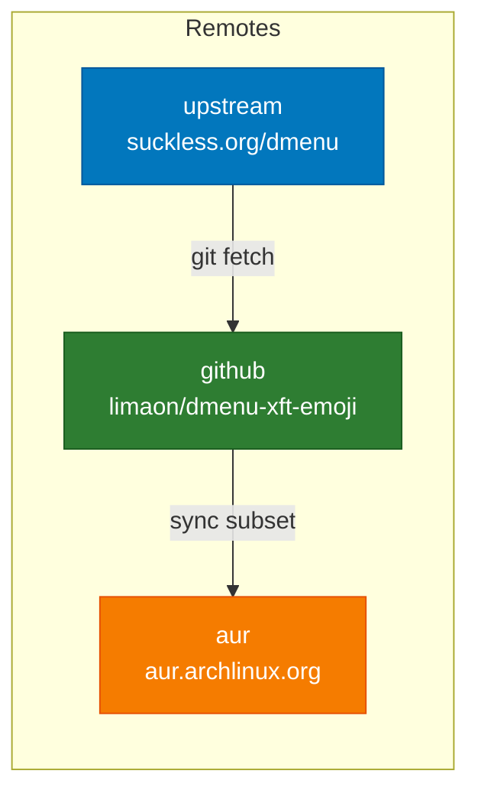
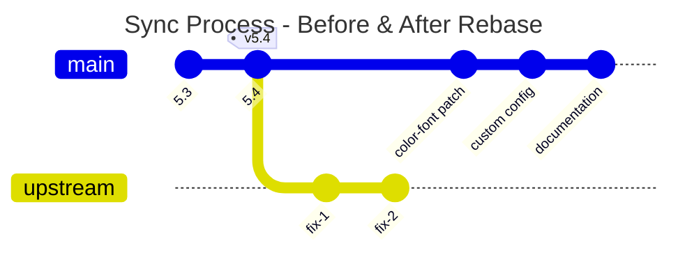
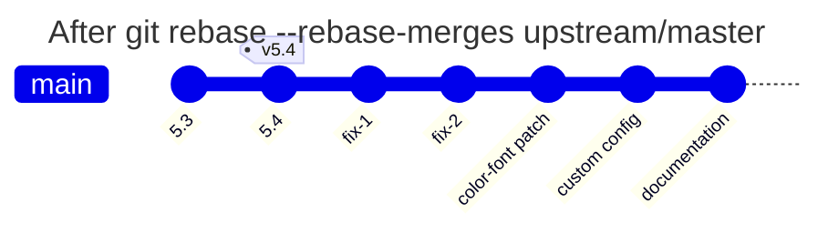
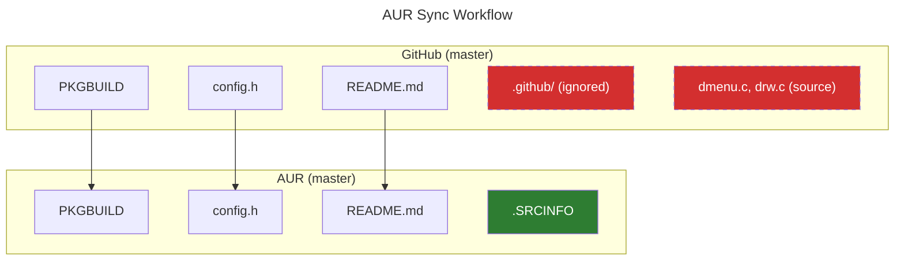

# dmenu-xft-emoji

**dmenu** with native color-font (emoji) rendering and automatic CJK fallback (漢字、かな、カタカナ). Built on top of dmenu 5.4 with a cascading font stack (`Terminus → Noto Sans CJK JP → Noto Color Emoji → monospace`).

## Features

* **Emoji support** - native since libXft 2.3.5 (no patch required)
* Seamless fallback for Chinese, Japanese and Korean glyphs
* **Mouse support** - click, scroll, and hover selection
* **Password mode** - hide input with `-P` flag
* **Tab navigation** - Tab/Shift+Tab to navigate items
* Lean, easy‑to‑edit `config.h`
* Arch Linux package (`PKGBUILD`) that **provides dmenu** and can fully replace the stock build
* Upstream repo is tagged, making builds reproducible

## Patches

This fork includes the following patches:

| Patch | Version | Description |
| ----- | :-----: | ----------- |
| `dmenu-mousesupport-5.4.diff` | 5.4 | Click to select, scroll to navigate, middle-click to paste |
| `dmenu-mousesupport-motion-5.2.diff` | 5.2 | Hover to select items (extends mouse support) |
| `dmenu-password-5.0.diff` | 5.0 | Hide input characters with `-P` flag |
| `dmenu-tab-navigation-5.4.diff` | 5.4 | Tab navigates down, Shift+Tab navigates up |

### Applying Patches

```bash
# Apply patches in order (motion depends on mouse support)
git apply dmenu-mousesupport-5.4.diff
git apply dmenu-mousesupport-motion-5.2.diff
git apply dmenu-password-5.0.diff
git apply dmenu-tab-navigation-5.4.diff

# Build
make clean && make
```

### Keyboard Shortcuts

| Key | Action |
| --- | ------ |
| `Tab` | Navigate to next item |
| `Shift+Tab` | Navigate to previous item |
| `↑` / `↓` | Navigate items |
| `Enter` | Select item |
| `Esc` | Exit without selection |

### Mouse Actions

| Action | Result |
| ------ | ------ |
| Left-click | Select item / clear input |
| Ctrl+Left-click | Multi-selection |
| Right-click | Close dmenu |
| Middle-click | Paste selection |
| Scroll up/down | Navigate items |
| Hover | Select item under cursor |

## Installation

### AUR (recommended)

```bash
paru -S dmenu-xft-emoji      # or yay / pikaur / aurutils …
```

> **Runtime deps**: `libxft`, `libxinerama`, `fontconfig`
> **Suggested fonts**: `terminus-font`, `noto-fonts`, `noto-fonts-cjk`, `noto-fonts-emoji`

## Quick test

```bash
echo -e "Hello 👋\nこんにちは" | dmenu -i
```

If both the emoji and the Kanji render, fallback is working.

## Repository Structure



## Updating from Upstream

This project tracks the official dmenu from [suckless.org](https://git.suckless.org/dmenu).

### Initial Setup (one-time)

```bash
git remote add upstream https://git.suckless.org/dmenu
```

### Sync with Upstream

```bash
# Fetch latest changes
git fetch upstream

# Rebase my commits onto latest upstream
git rebase --rebase-merges upstream/master

# If conflicts occur:
git status                    # see conflicted files
git checkout --ours FILE      # keep my changes (or --theirs for upstream)
git add FILE
git rebase --continue

# Push to GitHub (force needed after rebase)
git push github master --force
```

### How Rebase Works



**Before rebase:** My patches are based on an older upstream version.



**After rebase:** My commits are replayed on top of the latest upstream.

## Syncing to AUR

Since AUR doesn't allow subdirectories (like `.github/`), use this workflow to sync updates:



```bash
# Create clean branch from AUR
git checkout -b aur-sync aur/master

# Copy only AUR-compatible files from master
git checkout master -- PKGBUILD config.h README.md *.diff .SRCINFO

# Update .SRCINFO (must match PKGBUILD)
# Edit .SRCINFO with new version, checksums, and source files

# Commit and push to AUR
git add -A
git commit -m "Update to dmenu X.Y"
git push aur aur-sync:master

# Clean up
git checkout master
git branch -D aur-sync
```

### .SRCINFO Format

The `.SRCINFO` file must be manually updated to match `PKGBUILD`:

```
pkgbase = dmenu-xft-emoji
	pkgdesc = dmenu with emoji/CJK support, mouse, motion, password mode, tab navigation
	pkgver = 5.4
	pkgrel = 2
	url = https://tools.suckless.org/dmenu/
	arch = x86_64
	license = MIT
	depends = libxft
	depends = libxinerama
	depends = fontconfig
	optdepends = terminus-font: bitmap Terminus for X11
	optdepends = noto-fonts: base font family
	optdepends = noto-fonts-cjk: CJK glyphs
	optdepends = noto-fonts-emoji: color emoji
	conflicts = dmenu
	conflicts = dmenu-git
	provides = dmenu
	source = https://dl.suckless.org/tools/dmenu-5.4.tar.gz
	source = config.h
	source = dmenu-mousesupport-5.4.diff
	source = dmenu-mousesupport-motion-5.2.diff
	source = dmenu-password-5.0.diff
	source = dmenu-tab-navigation-5.4.diff
	sha256sums = <dmenu-tarball-checksum>
	sha256sums = <config-checksum>
	sha256sums = <patch1-checksum>
	sha256sums = <patch2-checksum>
	sha256sums = <patch3-checksum>
	sha256sums = <patch4-checksum>

pkgname = dmenu-xft-emoji
```

## Contributing

1. **Fork** and create a topic branch: `git checkout -b feature/name`.
2. Commit in logical chunks with clear English messages.
3. Open a pull request against `main`.
4. Use the issue tracker for questions or bug reports.

## License

Released under the MIT License. See `LICENSE` for details.
